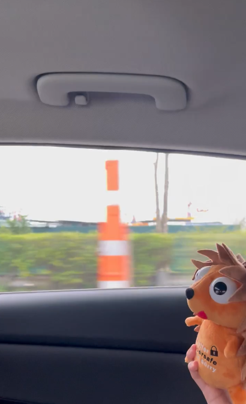

# Stack The Flags 2022: Finding Nyan


## Description

> Jaga is on a road trip to find Nyan. Do you know which road is this in the meteverse?

> Note that for this challenge, the road name is case sensitive, example - `STF22{Jln_Binchang}`. The road name should be the exact address seen on Google Maps


## Attached Files

- Finding Nyan.MOV
- https://tinyurl.com/bdk5pwj6 (download link for video)

## Summary

We find a speed camera, as well as a Bukit Batok Driving Centre car. We then look through speed cameras in Bukit Batok and find the road.

## Flag

```
STF22{BUKIT_BATOK_RD}
```

## Detailed Solution

When we watch the video, we can see that the person is driving down a road, next to a construction site.\
If we slow down the video and watch it frame by frame, we discover that there is a speed camera
\
Even though it looks similar to a red light camera, there are some visual differences and we used  to tell the difference between them\
Speed cameras are useful when spotted, as there are lists of speed cameras in Singapore online and it can become easy to narrow down where the video is taken at.\
The one that we used for the challenge was .\

At the bottom of the list, it tells us that there are 91 speed cameras in Singapore as of 2019\
Even though we could look through all 91 locations, it would not only be boring, but also take a long time.\

Instead, we 
